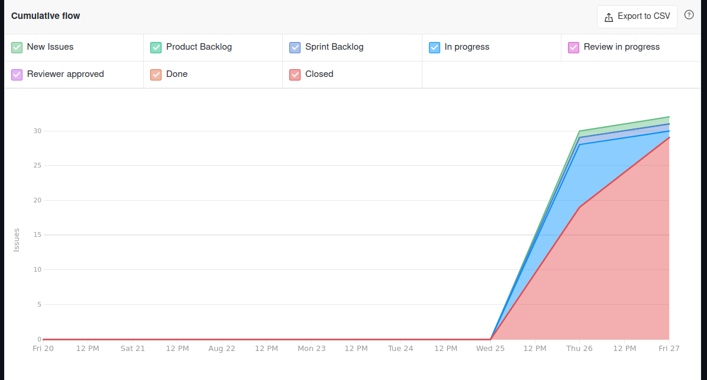
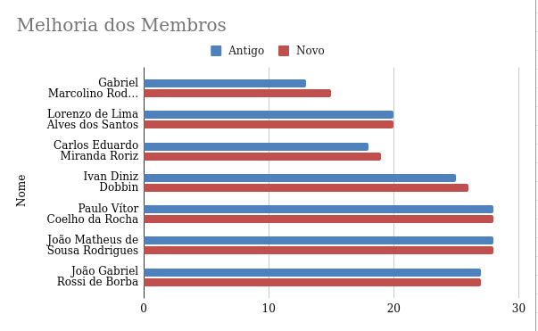

# Sprint Review

## Histórico de Revisão
| Data | Versão | Descrição | Autor(es)|
|:----:|:------:|:---------:|:--------:|
| 25/08/21 | 0.1 | Adiciona histórico de revisão, análise do Scrum Master e começa a preencher os riscos e o conhecimento dos membros  | [Ivan Diniz Dobbin](https://github.com/darmsDD), [João Rossi](https://github.com/bielrossi15) |
| 29/08/21 | 0.2 | Adiciona os gráficos do velocity e burndown| [Ivan Diniz Dobbin](https://github.com/darmsDD) |
| 29/08/21 | 0.3 | Adiciona os gráficos do cycle time e cumulative flow, também atualiza a análise do scrum master| [Ivan Diniz Dobbin](https://github.com/darmsDD) |
| 01/09/21 | 1.0 | Atualiza burndown e velocity, também adiciona gráfico de riscos e atualiza análise| [Ivan Diniz Dobbin](https://github.com/darmsDD) |

## Quando
Essa sprint se iniciou no dia 20/08/2021 e durou 7 dias terminando dia 27/08/2021 

## Análise do Scrum Master

A primeira sprint foi destinada a montagem do ambiente e a produção do backlog. 
Foi percebido um bom ritmo de trabalho com todos os membros realizando seus papéis e 
as tarefas sendo concluidas. A equipe de EPS acabou trabalhando mais pois necessitava arrumar a documentação e o ambiente antes que MDS pudesse iniciar os códigos. É observado tal fato olhando o planning. 

A equipe teve um pouco de dificuldade no começo da sprint, pois quando estávamos na Lean Inception ou Product Backlog Building não haviam sprints. Após terminar esses 2 workshops e a configuração inicial dos repositórios, a equipe dividiu tarefas para a semana, porém não montaram o sprint backlog. Não tinham percebido que poderiam começar as sprints, assim para evitar atrasos foi feito o sprint backlog juntamente com as outras tarefas.

Percebesse pelos gráficos uma tendência das tarefas iniciarem e serem completadas em pouquíssimos dias, menos de 2 em sua maioria. Isso aconteceu por uma falta de organização da equipe no começo da sprint. Este fato não deve ocorrer novamente.
Observe também pelo gráfico do [Cycle Time](#cycle-time) que houve confusão até em criar as issues, o padrão deveria ser NEW ISSUES -> PRODUCT BACKLOG -> SPRINT_BACKLOG -> REVIEW IN PROGRESS -> REVIEW APPROVED -> CLOSED OU DONE. Isso também será consertado para sprints posteriores.

Observe por também que essa sprint não teve pontos, tivemos muitas tarefas porém nenhuma história de usuário. Foi feito também um gráfico sobre os possíveis riscos da sprint 1, para mitigar esses riscos nós fizemos uma reunião para resolver o problema das presenças, demos treinamentos para diminuir a probabilidade da falta de conhecimentos e temos reuniões semanais com o cliente pra  melhor entendimento dos requisitos. 

## Riscos

## Burndown
Não houve pontuação nessa sprint

## Velocity
Não houve pontuação nessa sprint

## Cumulative Flow

## Cycle Time
### Ciclo de uma tarefa do in progress para closed

## Conhecimento dos Membros

